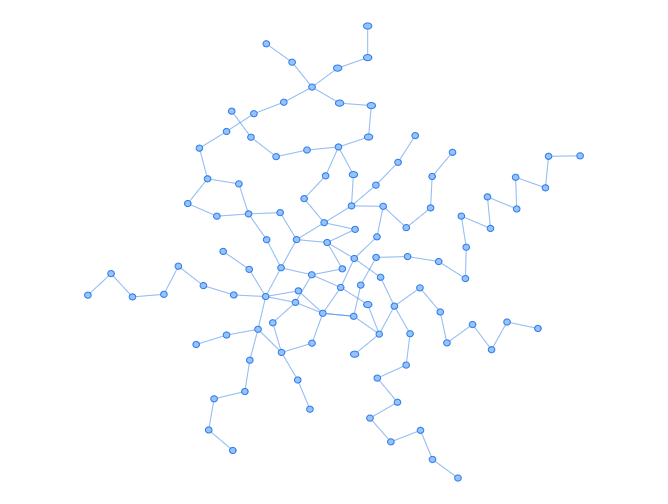

# Usage
```
python averagepath.py
```
# Output
```
AveragePath: 9.592252803261978
```
平均長の出力と隣接リスト/行列ファイルを生成する．

# Overline
1. 隣接リスト構築
2. 隣接リスト/行列変換
	- グラフ可視化ツールを用いて正しいネットワークであることを確認
3. Floyd-Warshall 法を用いて最短経路長を求める
4. 平均経路長を求める

# Constructed OsakaMetro Network
 

使用した大阪メトロ路線図
https://subway.osakametro.co.jp/guide/routemap.php

競技プログラミング界隈で有名な隣接グラフ/行列可視化サイト
https://hello-world-494ec.firebaseapp.com/
